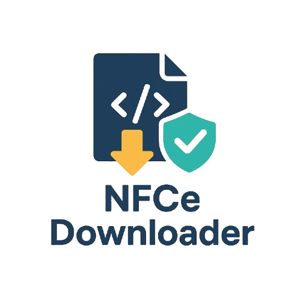

# NFCe Downloader



Um downloader automatizado de XMLs de Notas Fiscais de Consumidor Eletrônica (NFC-e) do portal DFe RS, com suporte a certificados digitais e resolução automática de CAPTCHAs.

## 📋 Descrição

O NFCe Downloader é uma ferramenta Python desenvolvida para automatizar o processo de download de XMLs de NFC-e do portal DFe do Rio Grande do Sul. O sistema utiliza certificados digitais para autenticação e resolve automaticamente CAPTCHAs reCAPTCHA v2 através de serviços de resolução como AntiCaptcha, CapSolver e CapMonster.

## ✨ Funcionalidades

- ✅ **Autenticação com certificado digital** (formato .pfx)
- ✅ **Resolução automática de CAPTCHAs** reCAPTCHA v2, hCaptcha e Turnstile
- ✅ **Download automático de XMLs** de NFC-e
- ✅ **Suporte a múltiplos ambientes** (produção e homologação)
- ✅ **Configuração flexível** via arquivo INI
- ✅ **Requisições HTTPS seguras** com validação de certificados
- ✅ **Interface assíncrona** para melhor performance

## 🚀 Instalação

### Pré-requisitos

- Python 3.12 ou superior
- Poetry (gerenciador de dependências)
- Certificado digital válido (.pfx)
- Chave de API de um serviço de resolução de CAPTCHA

### Passos de instalação

1. **Clone o repositório:**
   ```bash
   git clone <url-do-repositorio>
   cd NFCe_downloader
   ```

2. **Instale as dependências com Poetry:**
   ```bash
   poetry install
   ```

3. **Ative o ambiente virtual:**
   ```bash
   poetry shell
   ```

4. **Configure o arquivo `config.ini`:**
   ```ini
   [general]
   cert_pfx_path = certificados/seu_certificado.pfx
   cert_pfx_pass = sua_senha_do_certificado
   cnpj = seu_cnpj_sem_pontuacao
   production = true  # ou false para homologação

   [website]
   site_url = https://dfe-portal.svrs.rs.gov.br
   site_key = 6LcPrHYUAAAAAFc6TCjw0pq2qDKQ3dzHHlqOh3J9

   [captcha]
   captcha_api_key = sua_chave_api_do_captcha
   captcha_solver_engine = capsolver  # ou anticaptcha, capmonster
   ```

## 📖 Uso

### Uso básico

```python
import asyncio
from nfce_downloader.downloader import get_homepage, download_xml

async def main():
    # Chave de acesso da NFC-e (44 dígitos)
    nfce_key = "32250933865985000177650010000403981893040009"
    
    # Fazer download do XML
    xml_content = await download_xml(
        "https://dfe-portal.svrs.rs.gov.br",
        nfce_key,
        site_key="6LcPrHYUAAAAAFc6TCjw0pq2qDKQ3dzHHlqOh3J9",
        pfx_path="certificados/certificado.pfx",
        pfx_password="senha123",
        ambiente="1"  # 1=produção, 2=homologação
    )
    
    print(f"XML baixado com sucesso!")

if __name__ == "__main__":
    asyncio.run(main())
```

### Executando o exemplo principal
``` bash
python main.py
```
## 🔧 Configuração
### Estrutura do arquivo `config.ini`

| Seção | Parâmetro | Descrição |
| --- | --- | --- |
| `general` | `cert_pfx_path` | Caminho para o certificado .pfx |
| `general` | `cert_pfx_pass` | Senha do certificado digital |
| `general` | `cnpj` | CNPJ sem pontuação |
| `general` | `production` | true=produção, false=homologação |
| `website` | `site_url` | URL do portal DFe RS |
| `website` | `site_key` | Chave do site para reCAPTCHA |
| `captcha` | `captcha_api_key` | Chave da API do serviço de CAPTCHA |
| `captcha` | `captcha_solver_engine` | Engine: capsolver, anticaptcha ou capmonster |

### Serviços de CAPTCHA suportados
1. **CapSolver** (recomendado)
    - Site: [https://capsolver.com/](https://capsolver.com/)
    - Custo-benefício excelente

2. **AntiCaptcha**
    - Site: [https://anti-captcha.com/](https://anti-captcha.com/)
    - Serviço confiável e rápido

3. **CapMonster**
    - Site: [https://capmonster.cloud/](https://capmonster.cloud/)
    - Alternativa robusta

## 📂 Estrutura do Projeto
``` 
NFCe_downloader/
├── nfce_downloader/           # Pacote principal
│   ├── __init__.py
│   ├── downloader.py          # Lógica principal de download
│   ├── services/              # Serviços auxiliares
│   │   └── captcha_solver.py  # Resolução de CAPTCHAs
│   └── utils/                 # Utilitários
│       └── requests_pfx_adapter.py  # Adapter para certificados .pfx
├── certificados/              # Certificados digitais
├── config.ini                 # Configurações
├── main.py                   # Script principal de exemplo
├── pyproject.toml            # Configuração do Poetry
└── README.md                 # Este arquivo
```
## 🔐 Segurança
- **Certificados**: Mantenha seus certificados digitais em local seguro
- **Senhas**: Não commite senhas no repositório
- **APIs**: Proteja suas chaves de API dos serviços de CAPTCHA
- **HTTPS**: Todas as requisições utilizam conexões seguras

## 🐛 Troubleshooting
### Problemas comuns
1. **Erro de certificado expirado**
``` 
   Client certificate expired: Not After: 2024-12-31 23:59:59Z
```
**Solução**: Renove seu certificado digital
1. **Erro de CAPTCHA não resolvido**
``` 
   Erro: token do captcha não foi resolvido.
```
**Solução**: Verifique sua chave de API e saldo no serviço de CAPTCHA
1. **Erro 403 Forbidden** **Solução**: Verifique se o certificado digital está correto e válido

## 🤝 Contribuindo
1. Faça um fork do projeto
2. Crie uma branch para sua feature (`git checkout -b feature/AmazingFeature`)
3. Commit suas mudanças (`git commit -m 'Add some AmazingFeature'`)
4. Push para a branch (`git push origin feature/AmazingFeature`)
5. Abra um Pull Request

## 📋 TODO
- Suporte a download em lote
- Interface gráfica (GUI)
- Logs mais detalhados
- Validação de XMLs baixados
- Cache de sessões
- Suporte a outros portais DFe

## 📄 Licença
Este projeto está sob a licença MIT. Veja o arquivo `LICENSE` para mais detalhes.
## 📞 Contato
**Cleiton Leonel**
- Email: cleiton.leonel@gmail.com
- GitHub: [Seu perfil no GitHub]

## ⚠️ Aviso Legal
Este software foi desenvolvido para fins educacionais e de automação legítima. Use apenas com certificados digitais próprios e para NFC-es que você tenha direito de acessar. O autor não se responsabiliza pelo uso indevido desta ferramenta.
⭐ **Se este projeto foi útil para você, considere dar uma estrela no GitHub!**
